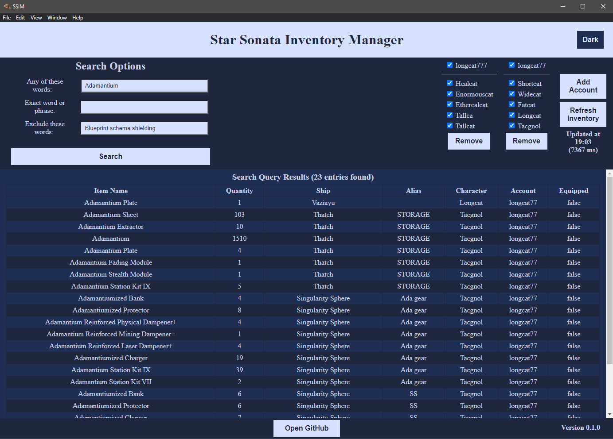

# Star Sonata Inventory Manager
Star Sonata Inventory Manager (SSIM) is a tool that allows users to search items in their Star Sonata accounts.

# How it works

SSIM works by requesting XML data from https://www.starsonata.com/user/assets/. Account asset data is gathered and can be searched through the user interface. This allows the user to run a single search over all assets instead of opening and manually searching every XML file. Multiple accounts can be added.

Account information is stored locally on your machine and passwords are only decrpyted when connecting to Star Sonata servers.

### Limitations

Transcendental Storage Locker (TSL) is not available in starsonata.com's asset table. Items in the TSL will not show up in this program.

If the Star Sonata developers decide to modify their asset page or how they store data, this program will no longer function until updated.

# Installation

### Windows

1) Download [SSIM-win32-x64.zip](https://github.com/ericmalmquist7/Star-Sonata-Inventory-Manager/raw/release/SSIM-win32-x64.zip).
3) Unzip the file on your computer.
4) Open the folder and run SSIM.exe!

Note that Windows will likely warn you the file may be malicious - This is because this application is not signed by a certificate authority. (Costs money)

### MacOS

Not implemented (yet).

### Linux

Not implemented (yet).

# How to contribute to this project

Create bug reports by creating [issues](https://github.com/ericmalmquist7/Star-Sonata-Inventory-Manager/issues).

Give feedback on the user experience - should the search engine behave differently? Are controls intuitive and easy to follow?

Improve developer experience by recommending improvements to this GitHub; I'm still learning how to efficiently setup collaborative projects!

Suggest improvements to the code base, highlight poorly developed code, or simply let me know how much you hate JavaScript.

Reach out to me on [Discord](https://discordapp.com/users/210931049474031616) or through [GitHub](https://github.com/ericmalmquist7).

# Developer Environment Setup

!!!This section is a work in progress!!!

1) Clone this repository.
2) Install (VSCode)[https://code.visualstudio.com/]
3) Install (ESLint)[https://eslint.org/] plugin. (Optional)
4) Install NPM, and maybe a bunch of other stuff. I need to figure out if dependencies are installed automatically from package.json, or if manual effort is required.
5) Include a note about attaching a debugger to the main process

I'll get around to this when it's not 1am.

# Technical Information

SSIM is built using Electron to allow a single code base across multiple platforms. This comes at a cost of a larger file size.

All code is written in JavaScript, HTML, and CSS.

### Electron Process Model

In Electron projects, the [Process Model](https://www.electronjs.org/docs/latest/tutorial/process-model) is used; this includes the main process, and the renderer process.

The main process is responsible for managing the lifetime of windows and navigating to different HTML pages. It is also responsible for storing and retrieving locally stored data, issuing requests to Star Sonata servers, and parsing XML data. This file can be found [here](SSIM/main.js).

The renderer process is the core logic for the 'front end' side. This process is responsible for handling user inputs and displaying data. The home page renderer can be found in [renderer.js](SSIM/js/renderer.js) and the new account renderer can be found in [accountWindow.js](SSIM/js/accountWindow.js).

Communication between these processes is handled via Interprocess Communication (IPC). For more detailed information, check Electron's [documentation](https://www.electronjs.org/docs/latest/api/ipc-main).

### Retrieving asset data

SSIM issues requests by using [Request](https://github.com/request/request) to log into starsonata.com and navigate to the asset table located at https://www.starsonata.com/user/assets/.

From the asset table, character XML links are scraped using [Cheerio](https://www.npmjs.com/package/cheerio) and downloaded with more requests.

Finally, the XML is converted to a JavaScript object using [xml2js](https://www.npmjs.com/package/xml2js).

All functionality for retrieving asset data can be found in [xmlRequest.js](SSIM/js/xmlRequest.js).

### Code Conformity

JavaScript code follows the JavaScript standard with the following modifications:
* Indentation of 4 spaces is enforced

VSCode with [ESLint](https://eslint.org/) is recommended. The eslint configuration file can be found [here](SSIM/.eslintrc.json).

The eslint file can be found in [eslintrc.json](SSIM/.eslintrc.json).

# Licensing

TODO: Pick a license.

Should be open source, probably GNU General Public License v3.0
